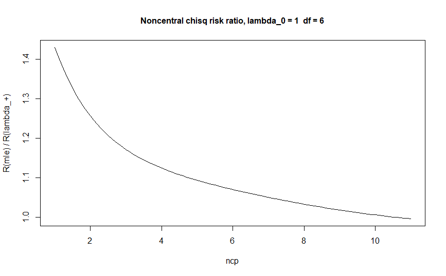
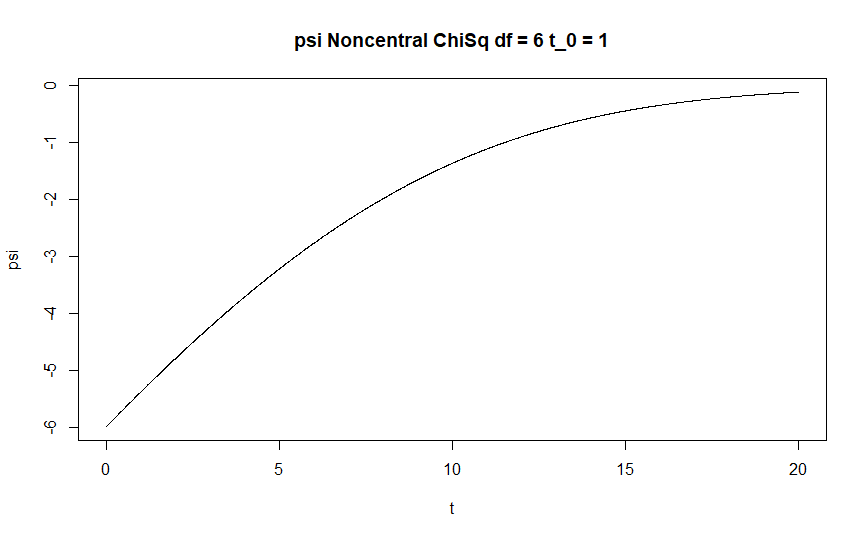

#Estimation of noncentrality parameter for mixture models

For mixture models such as noncentral chi-square, noncentral Fisher, the unbiased estimator takes values outside of the parameter space making it an unadmissible estimator. What other estimator can we consider instead?

## Noncentral chi-square

Let's consider $X$ a noncentral chi-square with $p > 0$ degrees of freedom and noncentrality parameter $\lambda \geq 0$. We note $X \sim \chi_p(\lambda)$ and $F_{p, \lambda}(\cdot)$ its cdf. If $\lambda = 0$, then $X$ is a standard chi-square. 

We can rewrite  $X$ as a mixture of gamma and Poisson distributions. Using this representation, we can easily verify that $X - p$ is the unbiased estimator for $\lambda$ which takes negative values, if the observation is smaller than $p$. A simple alternative would be to use $\lambda_+(X) = \max \{0, X - p\}$ instead. Even though this estimator isn't smooth and so unadmissible, it's still quite good as it dominates the mle under quadratic loss as defined by [Saxena and Alam (1982)](https://projecteuclid.org/euclid.aos/1176345892) if $p \geq 1$. In the case of $\lambda \geq \lambda_0$ for some $\lambda_0 > 0$, the truncation of the unbiased estimator on the parameter space still dominates the mle for $p \geq 2$ (see Chapter 3 of [my master's thesis](https://savoirs.usherbrooke.ca/handle/11143/16157)).

Another alternative to the unbiased estimtor is to add some correction term to $X - p$ so it lies on the parameter space. With the approach suggested by [Kubokawa, Marchand and Strawdermann (2017)](https://www.researchgate.net/publication/318046085_A_unified_approach_to_estimation_of_noncentrality_parameters_the_multiple_correlation_coefficient_and_mixture_models), we estimate $\lambda \geq \lambda_0 > 0$ with $X - p - \psi(X)$ for some non decreasing $$\psi \geq \mathds{E}_{\lambda_0}(W \mid W \leqslant w)-\lambda_0 \frac{F_{p+2,\lambda_0}(w)}{F_{p,\lambda_0}(w)},$$ that asymptotically converges to 0. 

Under quadratic loss, we get the following risk ratio:

## Other mixtures models

Code for noncentral Fisher is available.

Coming soon : Coefficient of determination (mixture of beta prime and negative binomial).